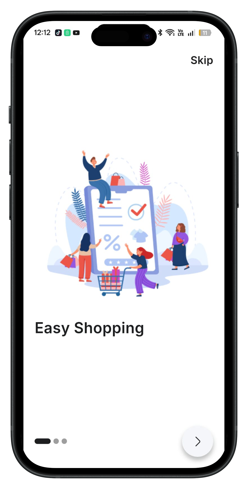
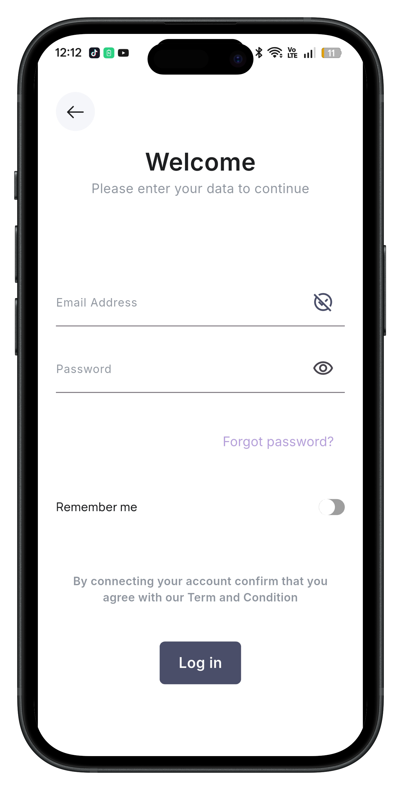
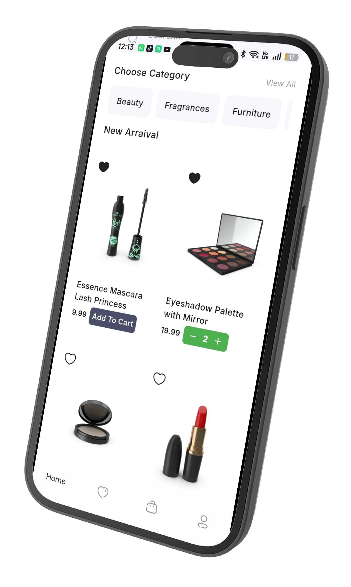
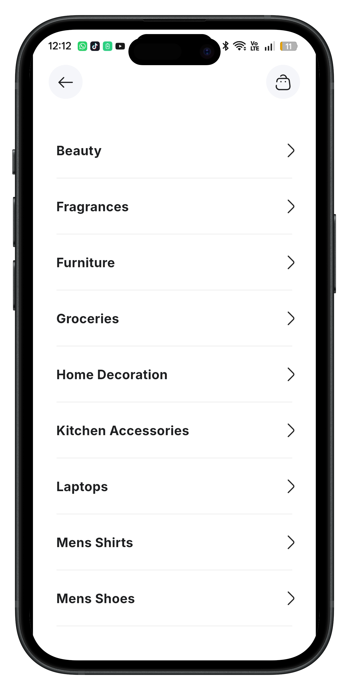
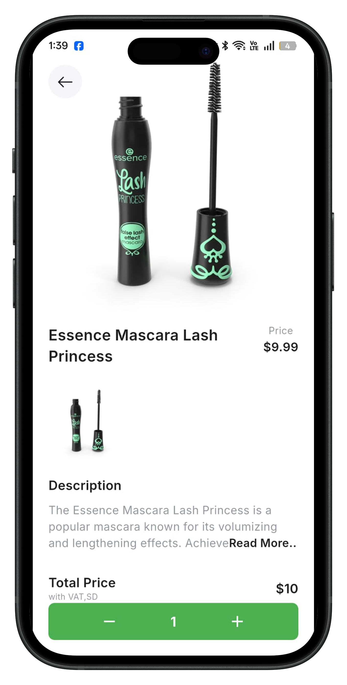
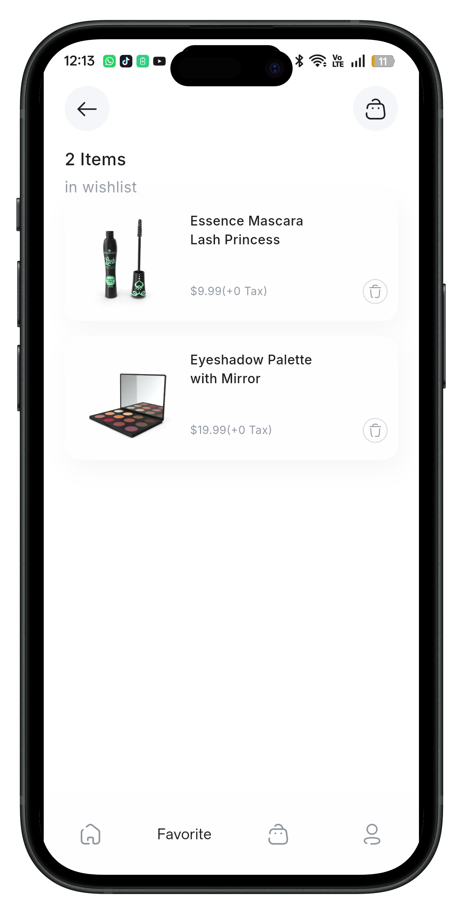
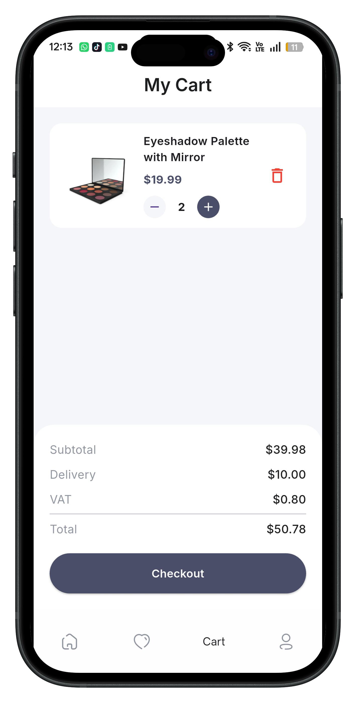
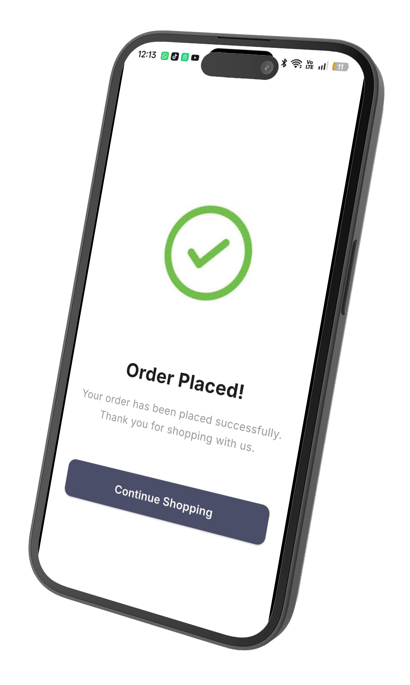
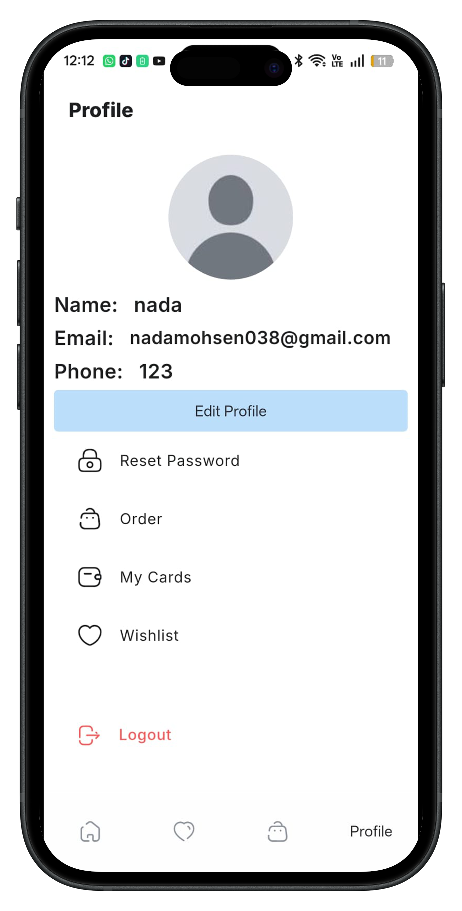

# 🛍️ E-Commerce App

A modern E-Commerce mobile application built with **Flutter**, **Firebase**, and **BLoC**, providing a clean UI and a smooth shopping experience.

---

## ✨ Features

* 🔐 Authentication (Login & Register)
* 🏠 Home Screen
* 📂 Categories
* 🔍 Search Products
* 🛍️ Product Details
* ❤️ Wishlist
* 🛒 Shopping Cart
* ➕ Quantity Management
* 💳 Checkout
* ✅ Order Confirmation
* 👤 User Profile
* ✏️ Edit Profile
* 🔑 Reset Password
* 📱 Responsive UI

---

## 📱 App Screenshots

| OnBoarding                      | Login                      | Home                      |
| ------------------------------- | -------------------------- | ------------------------- |
|  |  |  |

| Categories                      | Product Details              | favorites                      |
| ------------------------------- | ---------------------------- | ----------------------------- |
|  |  |  |

| Cart                      | Checkout                   | Profile                      |
| ------------------------- | -------------------------- | ---------------------------- |
|  |  |  |

---

## 🏗️ Architecture

* Cubit State Management
* Feature-based Clean Folder Structure
* REST API Integration
* Firebase Authentication
* Cloud Firestore
* Shared Preferences

---

## 🛠️ Tech Stack

* Flutter
* Dart
* flutter_bloc
* Firebase Authentication
* Cloud Firestore
* Dio
* Shared Preferences
* Flutter ScreenUtil

---

## 🚀 Getting Started

```bash
flutter pub get
flutter run
```

---

## 📂 Project Structure

```text
lib/
├── features/
├── models/
├── shared/
├── main.dart
```

---

## 👩‍💻 Developer

**Nada Mohsen Ahmed**

 Flutter Developer

* 💼 Flutter & Dart
* 🔥 Firebase
* 🧩 Cubit State Management
* 📱 Mobile App Development
